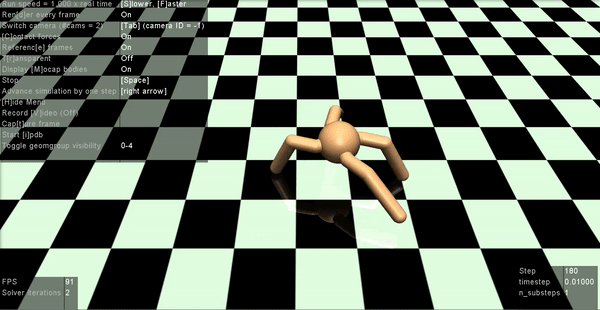

# Experiments with OpenAI Robotics Environment
1) Training Ant-v2 (make a four-legged 
creature walk forward as fast as possible).
https://gym.openai.com/envs/Ant-v2/

Random Agent            |  Trained Keras-rl Agent     |
:-------------------------:|:-------------------------:|
  |   |  